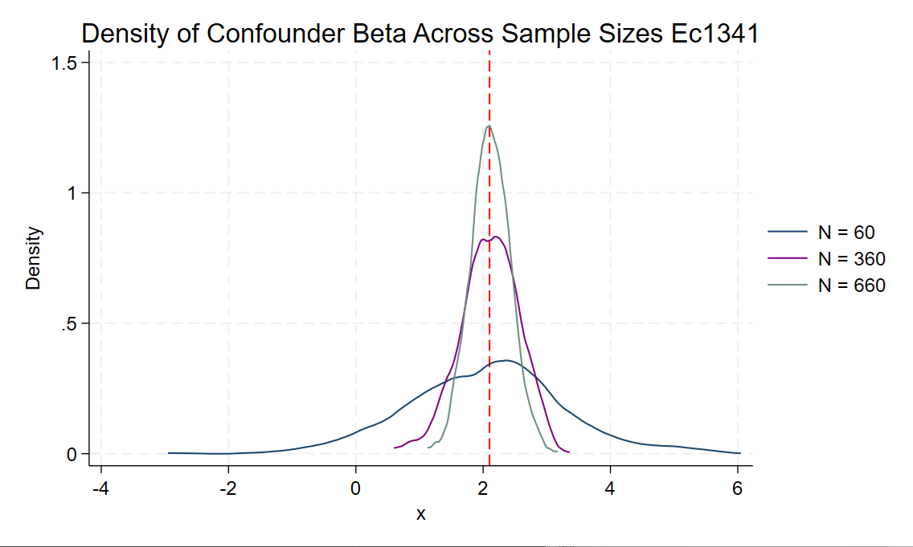
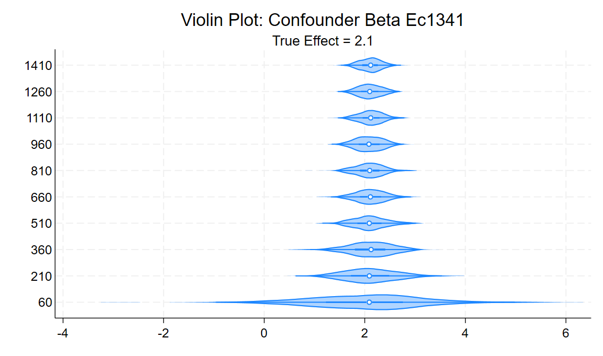

# 📊 Assignment 4 — Power Calculations and De-biasing (Emmanuel Carrasco)

## Overview

This repository contains Stata code and analysis for **Assignment 4** of PPOL 6818 (Spring 2025).

We explore:
✅ Power calculations at the individual and cluster level  
✅ The role of covariates and fixed effects in de-biasing parameter estimates  
✅ How sample size and model specification influence precision and convergence

---

## Part 1: Individual-Level Power Calculations

We simulate an outcome variable **Y** drawn from a standard normal distribution (mean = 0, sd = 1), apply treatment effects between 0 and 0.2 SD, and use Stata’s `power twomeans` to calculate required sample sizes under:
- 50% treatment vs. control  
- 15% expected attrition  
- Only 30% of units receiving treatment

The Stata code for this section is available in [`assignment4.do`](assignment4.do).

---

## Part 2: Cluster-Level Power Calculations

We simulate clustered data with:
- Intra-cluster correlation (ICC) ≈ 0.3  
- Treatment assigned at the **cluster** (school) level  
- Simulated uptake rates of 100% and 70%

We investigate how increasing **cluster size** or **number of clusters** affects power, and plot results comparing model performance across settings.

---

## Part 3: De-biasing Parameter Estimates Using Controls

We construct a data-generating process (DGP) where:
- The outcome **Y** is influenced by:
  - A **confounder** (affects both treatment and outcome)  
  - A covariate affecting only outcome  
  - A covariate affecting only treatment  
  - Strata fixed effects

The true equation is:
> **Y = β₁ * Confounder + β₂ * Treatment + β₃ * (Treatment × Treatment Effect) + Strata Fixed Effects**

We estimate five regression models combining these variables and compare their estimates of the confounder’s effect across growing sample sizes.

---

### 📈 Density Plot of Confounder Beta Across Sample Sizes

- **N = 60 (navy)** → Wider, less precise distribution  
- **N = 360 (purple)** → Narrowing around the true effect (2.1)  
- **N = 660 (teal)** → Tightest, most precise estimates

---

### 🎻 Violin Plot: Confounder Beta Across Sample Sizes

- The violins “funnel” inward as sample size increases, illustrating reduced variance.
- Centers consistently approach the **true effect** of 2.1, confirming the estimator’s consistency.

---

## 📊 Summary Table of Estimates

| Sample Size | Mean (m1) ± SD | Mean (m2) ± SD | Mean (m3) ± SD | Mean (m4) ± SD | Mean (m5) ± SD |
|-------------|-----------------|----------------|----------------|----------------|----------------|
| 60          | 2.05 (1.22)     | -0.12 (0.25)   | 2.10 (0.13)    | 2.04 (1.23)    | 2.10 (≈0)      |
| 210         | 2.12 (0.56)     | -0.09 (0.13)   | 2.10 (0.06)    | 2.11 (0.55)    | 2.10 (≈0)      |
| 360         | 2.10 (0.46)     | -0.10 (0.10)   | 2.10 (0.05)    | 2.10 (0.46)    | 2.10 (≈0)      |
| 510         | 2.10 (0.36)     | -0.10 (0.08)   | 2.10 (0.04)    | 2.10 (0.37)    | 2.10 (≈0)      |
| 660         | 2.11 (0.31)     | -0.10 (0.07)   | 2.10 (0.04)    | 2.11 (0.31)    | 2.10 (≈0)      |
| 810         | 2.10 (0.30)     | -0.10 (0.06)   | 2.10 (0.03)    | 2.09 (0.30)    | 2.10 (≈0)      |
| 960         | 2.09 (0.28)     | -0.10 (0.06)   | 2.10 (0.03)    | 2.09 (0.28)    | 2.10 (≈0)      |
| 1110        | 2.12 (0.26)     | -0.10 (0.06)   | 2.10 (0.03)    | 2.12 (0.25)    | 2.10 (≈0)      |
| 1260        | 2.10 (0.24)     | -0.09 (0.05)   | 2.10 (0.02)    | 2.10 (0.24)    | 2.10 (≈0)      |
| 1410        | 2.11 (0.23)     | -0.09 (0.05)   | 2.10 (0.02)    | 2.11 (0.22)    | 2.10 (≈0)      |
| **Total**   | 2.10 (0.51)     | -0.10 (0.11)   | 2.10 (0.05)    | 2.10 (0.51)    | 2.10 (≈0)      |

---

## Conclusions

✅ Small sample sizes → More variability, less precision  
✅ Large sample sizes → Narrow, accurate, and precise estimates  
✅ Including confounders + fixed effects → Reduces bias and improves recovery of true effects

---

## 📂 Repository Contents

- `assignment4.do` → Stata code for all simulations  
- `densityofconfounder.png` → Density plot figure  
- `violinplot.png` → Violin plot figure  
- `README.md` → This file

---

