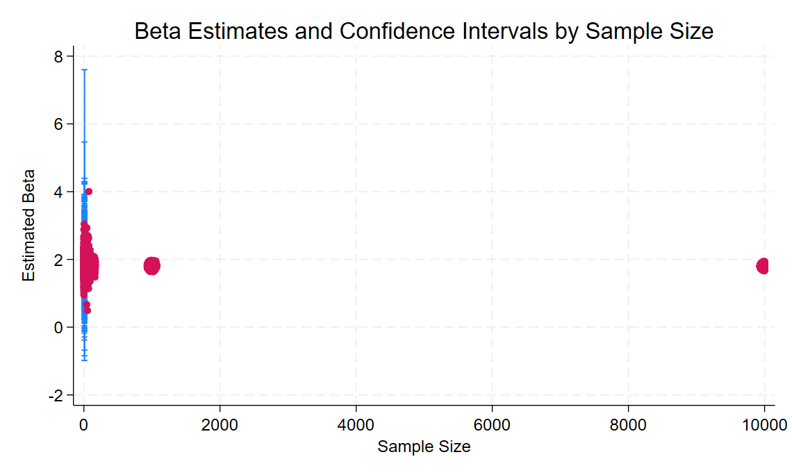
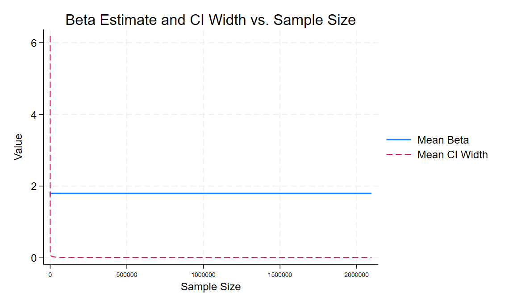
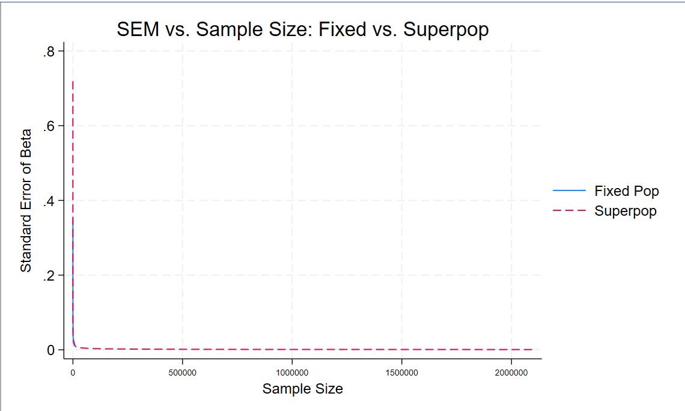

# Simulation Study: Fixed vs. Infinite Superpopulation

## Overview

We developed a simple data generating process (DGP) where:

- \( X \sim N(0, 1) \)
- \( \text{error} \sim N(0, 1) \)
- Outcome variable:  
  \[ Y = 1.8 \times X + \text{error} \]

This DGP is identical in both parts of the study.

---

## Part 1: Sampling from a Fixed Population

In this part, we created a fixed population of 10,000 individuals with generated \( X \) and \( Y \).  
Sampling noise here comes only from taking random samples from this **fixed dataset**.

We simulated 500 regressions at sample sizes:
- \( N = 10, 100, 1,000, 10,000 \)

**Key Figure**

This plot shows how the beta estimates stabilize and confidence intervals narrow as the sample size increases within the fixed population.

---

## Part 2: Sampling from an Infinite Superpopulation

In this part, each simulation draws a fresh dataset, effectively from an **infinite superpopulation**.

We simulated 500 regressions at sample sizes:
- Powers of two from 4 up to 2,097,152
- Plus: \( N = 10, 100, 1,000, 10,000, 100,000, 1,000,000 \)

**Key Figure**

This plot shows both the mean beta estimate and the confidence interval width across increasing sample sizes.

---

## Comparing Fixed vs. Infinite Sampling

We combined the two results to directly compare **standard errors** as sample sizes increase.

**Comparison Figure**

This figure illustrates the sharp drop in standard errors as sample sizes increase, with superpopulation simulations extending to far larger \( N \).

---

## Key Takeaways

- Increasing sample size reduces the standard error and tightens confidence intervals.
- The infinite superpopulation allows simulations at much larger \( N \), showing smoother convergence to the true beta.
- The fixed population stabilizes estimates faster but is inherently capped in variability.
- For very large \( N \), the infinite superpopulation achieves near-perfect precision.
